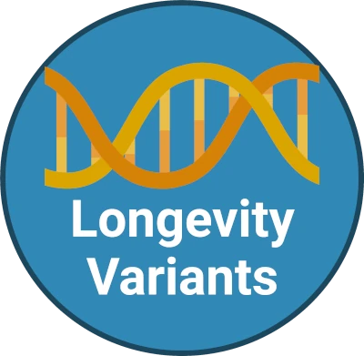
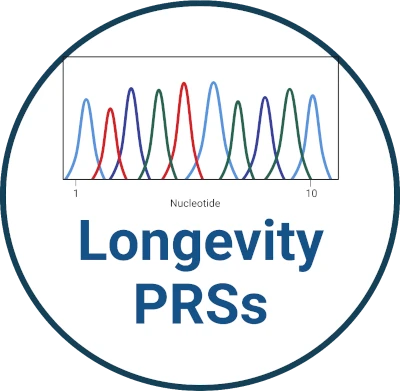

# _Just DNA-Seq_ #

  

_Just DNA-Seq_ is a set of open-source libraries and pipelines designed to help you with:
* realigning your raw genome reads and doing variant calling using the latest tools and [Bioinformatic pipelines](https://github.com/dna-seq/dna-seq)
* annotating your own genome with: 
  * known longevity and cancer risk variations with [longevity OakVar plugin](https://github.com/dna-seq/opencravat-longevity)
  * known [drug interactions](https://github.com/dna-seq/gero-drugs-module)
* getting a transparent open source polygenic health risk predictions

## Why _Just DNA-Seq_? ##

First human genome sequencing project concluded Apr 14, 2003 after more than 12 years of labor and costing around 3,000,000,000$. 
Today it turned from a great human endeavor to something widely accessible. Sequencing is commercially available at a price of roughly 400-800$. You get both sequencing and interpretation of the results for the price. In fact, the sequencing job is often served as a side dish to predictions.

So, why bother with the DIY approach when there is such a variety of commercical options?

The lack of transparency, privacy and, most importantly, room for customization are the main drivers for us, _Just DNA-Seq_ team, to develop a DIY toolbox.

Reports contents are typically decided by the service provider, your choice is limited with their product line. Results you get from such services are based on proprietary databases and algorithms. While having large R&D departments and a lot of medical data to base conclusions upon, their methods are not transparent at all, in many cases, you have no idea why they made this or that prediction. Verifying or comparing their results is therefore troublesome, especially, when you get totally different predictions from different companies.

More to that, what if we want to see how well our genes align with the prospect of longevity? On one hand, it is known that surviving up to 90 years is more about lifestyle choices. On the other hand living longer depends more on the genetics. People with exceptional longevity are not distinct in terms of lifestyle factors from the general population [[PMID: 21812767](https://doi.org/10.1111/j.1532-5415.2011.03498.x)]. Unfortunately, there are simply no commercial offerings at all to address the demand for longevity-related predictions.

At the same time, all the information necessary to do your own genomics research is out there, generously shared by the scientific community and openly available. 

So, why not to use existing open-source solutions then? Well, no luck here either! We've looked through the available solutions and found out there are no tools to cover one topic very close to our hearts: genetics of longevity. 

That’s when _Just DNA-Seq_ comes into play!

## How it works ##

The _Just DNA-Seq_ platform consists of _OakVar_ (Open-source Genomic Variant Analysis Platform) modules, bioinformatics pipelines, and additional libraries. One can realign and annotate the genome of interest employing _Just DNA-Seq_ tools to to retrieve polygenic risk scores (PRS), information about variants associated with age-related diseases or major life threatening risks and longevity-associated variants present in genome. 

  

| Section&nbsp;&nbsp;&nbsp;&nbsp;&nbsp;&nbsp;&nbsp;&nbsp;&nbsp;&nbsp;&nbsp;&nbsp;&nbsp;&nbsp;&nbsp;&nbsp;&nbsp;&nbsp; | Description |
|:---|:---| 
|  | Longevity variants report is based on 1900 variants from LongevityMap and other data sources which are scored and prioritized according to multiple criteria. It also depends on ClinGene, dbSNP and ClinVar modules. |
|                   | Longevity PRS report is based on existing longevity polygenic scores. At the moment, our best performing PRS is implements the score presented in [[PMC8087277](https://www.ncbi.nlm.nih.gov/pmc/articles/PMC8087277/)] and comprises 330 variants. This PRS was shown to be significantly associated with cognitively healthy aging and with prolonged survival. While it is not enough to have "centenarian" genes to become one, they are still needed to cut down major health risks and therefore gain longevity escape velocity. 
|                   | Of the major life threatening risks, Hereditary Cancers are the ones reliably predictable based on genetic variants data. Certain genetic variants determine a higher-than-average risk of developing a specific kind of cancer. The Oncological risks report includes about 300 genes, which are related to cancer predisposition, cancer progression and tumor cell motility.
|               | Aging is commonly associated with deteriorating health. As a result, plenty of drugs are commonly prescribed at an older age. Moreover, some of these drugs are now known to have geroprotective action in addition to their primary indications for medicine use (e.g. statins, metformin, rapamycin, etc.). To a large extent Drug metabolism is highly dependent on a person’s genetic polymorphisms because these variations affect the activity of xenobiotics-transforming enzymes. As a result, individual dose correction or even medication replacement is frequently required in order to avoid adverse effects. Longevity-drugs report is mostly based on data from PharmGKB database (https://www.pharmgkb.org/) and DrugAge and provides insight into one’s drug metabolism dispositions for a number of widely used drugs.|

## How to work with personal genome ##

Detailed user documentation is still in the making and will be available at [https://just-dna-seq.readthedocs.io](https://just-dna-seq.readthedocs.io)

Meanwhile we recommend [watching our workshop](https://www.youtube.com/watch?v=SL7F6LRJ_Ao)! It demonstrates and explains common use-cases are with the examples that you can reproduce. 

### Our team: ###

[@antonkulaga](http://github.com/antonkulaga) - bioinformatician at [Systems Biology of Aging Group](http://aging-research.group) and [CellFabrik](http://cellfabrik.bio)

[@winternewt](http://github.com/winternewt) - software developer with a chemical background, bioinformatic pipelines developer

[@OlgaBorysova](http://github.com/OlgaBorysova) - biologist, geneticist, mitochondria expert, and founder of [MitoSpace](http://www.mt-eva.space/en/)

[@Alex-Karmazin](http://github.com/Alex-Karmazin) -  senior computer vision engineer, web developer

[@fkbyf14](http://github.com/fkbyf14)  - bioinformatician

### 
 [Our Github](https://github.com/dna-seq/)  [Our Gitcoin](https://gitcoin.co/grants/4048/just-dna-seq)   [Our Twitter](https://twitter.com/just_dna_seq)  [Our YouTube](https://www.youtube.com/channel/UCKJPXRJgi4Rxh9Lb1G_9SZw/)  
 ###
