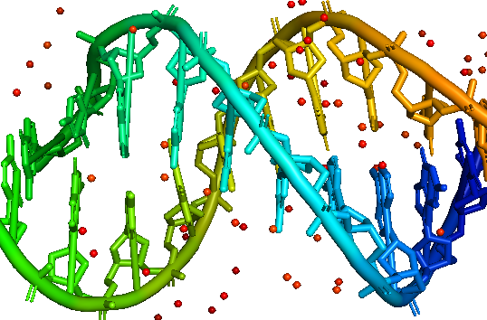
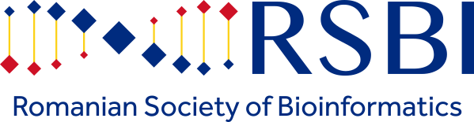

# Just-DNA workshop #

A free virtual event dedicated to providing guidance in personal genomic data analyzing, and longevity genetics.

If you are interested in analyzing your own genome and in the genetics of longevity this workshop is for you.

Join us and learn:
* how to analyze your personal genome with an open-source platform 
* how to choose modules for investigating different aspects of your genome (health risk prediction, personal drug response, etc.). 
* which longevity genes databases exist and how genetics affects our lifespan. 

Event Timing: 18:00-22:00 GMT+3 (Bucharest timezone), 9th of June, 2022

[Register now link](https://docs.google.com/forms/d/1cb0pSPUlYWK8st-7aKY3dSjqytyPweKJZX2kMgkX7hM/edit)

Organizer: Just-DNA-Seq Team and [Societatea Română de Bioinformatică](www.rsbi.ro) RSBI

## Who is the workshop addressed to: ##
* People having their DNA sequenced and interested in analyzing it
* Bioinformaticians
* Biologists 
* Everyone interested in longevity genetics
* Doctors interested in DNA analyzing tools
* Biohackers

## Agenda: ##
* About personalized genomics: methods of sequencing, analysis and interpretation of the genome.
* Genetics of Longevity. Existing databases and polymorphisms.
* Genetic investigation. You will be faced with  3 real Clinical cases trying to find answers with genome analysis tools.
* Polygenic risk scores - ML models for genetic risk predictions.
* Optional "BioWeapons" module (if time allows):  how to CRISPR-away the gene you do not like, pack it in adenovirus and get quotation in USD?

## Who we are: ##
Just-DNA-Seq is an international open-source project. 
We are aging researchers and longevity enthusiasts who are curious about their own personal genomics. 

### Our team: ###

[@antonkulaga](http://github.com/antonkulaga) - bioinformatician at [Systems Biology of Aging Group](http://aging-research.group) and [CellFabrik](http://cellfabrik.bio)

[@winternewt](http://github.com/winternewt) - software developer with a chemical background, bioinformatic pipelines developer

[@Alex-Karmazin](http://github.com/Alex-Karmazin) -  senior computer vision engineer, web developer

[@OlgaBorysova](http://github.com/OlgaBorysova) - biologist, geneticist, mitochondria expert, and founder of [MitoSpace](http://www.mt-eva.space/en/)

[@fkbyf14](http://github.com/fkbyf14)  - bioinformatician

### [Our twitter](https://twitter.com/just_dna_seq) ###
### [Our github](https://github.com/dna-seq/) ###
### [Our gitcoin](https://gitcoin.co/grants/4048/just-dna-seq) ###
### [Register link](https://docs.google.com/forms/d/1cb0pSPUlYWK8st-7aKY3dSjqytyPweKJZX2kMgkX7hM/edit) ###
